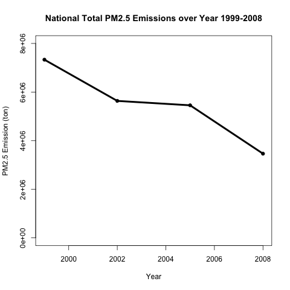
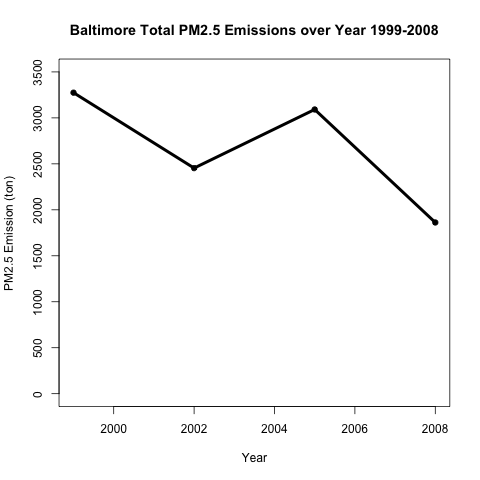
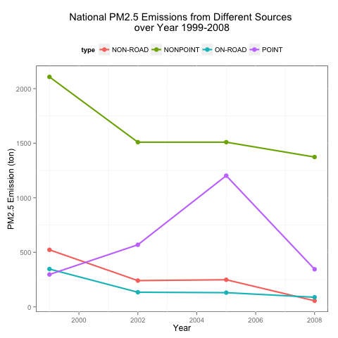
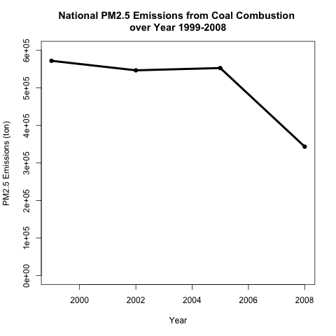
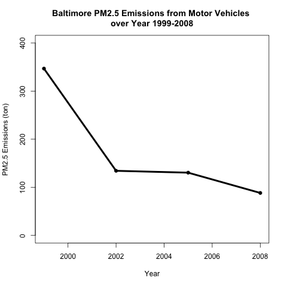
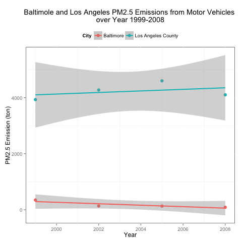

#PM2.5 Problems
## 0. Load the datasets
```r
# load gglopt2
library(ggplot2)
# load files
NEI = readRDS("exdata_data_NEI_data/summarySCC_PM25.rds")
SCC = readRDS("exdata_data_NEI_data/Source_Classification_Code.rds")
```
## 1. Plot1
Have total emissions from PM2.5 decreased in the United States from 1999 to 2008? Using the base plotting system, make a plot showing the total PM2.5 emission from all sources for each of the years 1999, 2002, 2005, and 2008.
```r
# subset NEI to get new dataframe containing Emission sum and year
sub1 = aggregate(NEI$Emissions,by = list(NEI$year,NEI$Pollutant),sum)
names(sub1) = c("Year","Pollutant","Total_Emission")
# draw the plot with base system
png(filename = "./plot1.png")
with(sub1,{
  plot(Year, Total_Emission, xlab = "Year", ylab = "PM2.5 Emission (ton)",main = 
      "National Total PM2.5 Emissions over Year 1999-2008", pch =19, ylim = c(0,8e+06))
  lines(Year, Total_Emission, lwd =4)
})
dev.off()
```
 

## 2. Plot2
Have total emissions from PM2.5 decreased in the Baltimore City, Maryland (fips == "24510") from 1999 to 2008? Use the base plotting system to make a plot answering this question.
```r
# subset NEI to Baltimore datawith emission sum and year
NEI_B = NEI[NEI$fips == 24510,]
sub2 = aggregate(NEI_B$Emissions,by = list(NEI_B$year,NEI_B$Pollutant),sum)
names(sub2) = c("Year","Pollutant","Total_Emission")
# draw thw plot with base system
png(filename = "./plot2.png")
with(sub2,{
  plot(Year, Total_Emission, xlab = "Year", ylab = "PM2.5 Emission (ton)",main = 
       "Baltimore Total PM2.5 Emissions over Year 1999-2008", pch =19, 
       ylim = c(0,3500))
  lines(Year, Total_Emission, lwd =4)
})
dev.off()
```
 

## 3. Plot3
Of the four types of sources indicated by the type (point, nonpoint, onroad, nonroad) variable, which of these four sources have seen decreases in emissions from 1999–2008 for Baltimore City? Which have seen increases in emissions from 1999–2008? Use the ggplot2 plotting system to make a plot answer this question.
```r
# subset NEI to Baltimore datawith emission sum and year
NEI_B = NEI[NEI$fips == 24510,]
sub3 = aggregate(NEI_B$Emissions,by = list(NEI_B$year,NEI_B$Pollutant,NEI_B$type),sum)
names(sub3) = c("Year","Pollutant","type","Total_Emission")
# draw the plot with ggplot2
png(filename = "./plot3.png")
g = ggplot(sub3, aes(Year, Total_Emission, col = type))
g = g + geom_point(size=3) + geom_line(size=1) + 
  labs(y = "PM2.5 Emission (ton)", title = "National PM2.5 Emissions from Different Sources \nover Year 1999-2008") +
  theme(legend.position = "top", panel.background = element_rect(fill = 'transparent', color = "black"))
print(g)
dev.off()
```
 

## 4. Plot4
Across the United States, how have emissions from coal combustion-related sources changed from 1999–2008?
```r
# find out the row range in SCC containg "Coal"
nameLib = grep("Coal", SCC$EI.Sector)
SCCLib = SCC[nameLib,]
# subset NEI with the SCC range and extract emission sum and year info
NEILib = subset(NEI, SCC %in% SCCLib$SCC)
sub4 = aggregate(NEILib$Emissions,by = list(NEILib$year,NEILib$Pollutant),sum)
names(sub4) = c("Year","Pollutant","Total_Emission")
# draw the plot with base system
png(filename = "./plot4.png")
with(sub4,{
  plot(Year, Total_Emission, xlab = "Year", ylab = "PM2.5 Emissions (ton)",main = 
      "National PM2.5 Emissions from Coal Combustion \nover Year 1999-2008", 
      pch =19, ylim = c(0,6e+05))
  lines(Year, Total_Emission, lwd =4)
})
dev.off() 
```
 

## 5. Plot5
How have emissions from motor vehicle sources changed from 1999–2008 in Baltimore City? 
```r
# find out the row range in SCC in group Onroad
nameLib = grep("Onroad", SCC$Data.Category)
SCCLib = SCC[nameLib,]
# subset NEI with the SCC range and extract emission sum and year info
NEI_B = NEI[NEI$fips == 24510,]
NEILib = subset(NEI_B, SCC %in% SCCLib$SCC)
sub5 = aggregate(NEILib$Emissions,by = list(NEILib$year,NEILib$Pollutant),sum)
names(sub5) = c("Year","Pollutant","Total_Emission")
# draw the plot with base system
png(filename = "./plot5.png")
with(sub5,{
  plot(Year, Total_Emission, xlab = "Year", ylab = "PM2.5 Emissions (ton)",main = 
      "Baltimore PM2.5 Emissions from Motor Vehicles \nover Year 1999-2008", 
      pch =19, ylim = c(0,400))
  lines(Year, Total_Emission, lwd =4)
})
dev.off()
```
 

## 6. Plot6
Compare emissions from motor vehicle sources in Baltimore City with emissions from motor vehicle sources in Los Angeles County, California (fips == "06037"). Which city has seen greater changes over time in motor vehicle emissions?
```r
# find out the row range in SCC in group Onroad
nameLib = grep("Onroad", SCC$Data.Category)
SCCLib = SCC[nameLib,]
# subset NEI with the SCC range and extract emission sum, year and city (baltimore vs la) info
NEI_B = NEI[NEI$fips %in% c('24510','06037'),]
NEILib = subset(NEI_B, SCC %in% SCCLib$SCC)
sub = aggregate(NEILib$Emissions,by = list(NEILib$year,NEILib$Pollutant,NEILib$fips),sum)
names(sub6) = c("Year","Pollutant","Total_Emission","City")
# draw plot with ggplot2
png(filename = "./plot6.png")
g = ggplot(sub6, aes(Year, Total_Emission, col = City))
g = g + geom_point(size=3) + geom_smooth(method="lm", size = 1) + 
   labs(y = "PM2.5 Emission (ton)", title = "Baltimole and Los Angeles PM2.5 Emissions from Motor Vehicles \nover Year 1999-2008") +
   theme(legend.position = "top", panel.background = element_rect(fill = 'transparent', color = "black")) 
print(g)
dev.off()
```
 


